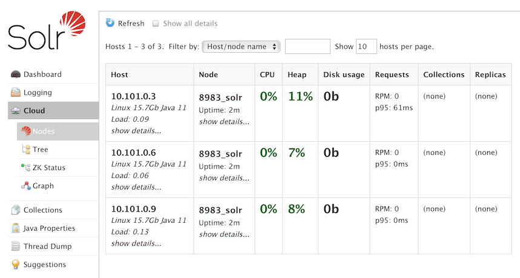
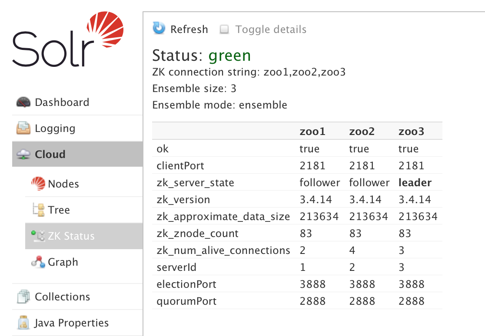
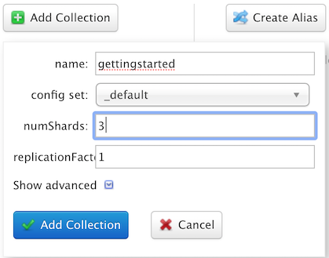
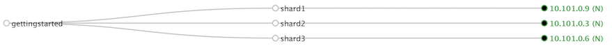

Running on Docker Swarm
=======================

This example shows a Docker Swarm stack deploy.

This requires a recent Docker Engine (I used 18.09.5), configured in swarm mode (see the [Swarm mode overview](https://docs.docker.com/engine/swarm/)). I used a 3-node cluster, where the nodes were called {`trinity10`,`trinity20`,`trinity30`}, and arranged for the ZooKeeper nodes to be placed on each. You'll want to modify the `docker-compose.yml` and change the node names for your hosts.

To Run
------

On the Swarm manager node:
```
docker stack deploy --compose-file docker-compose.yml trinitysolr
```

To test
-------

On the Swarm manager node, inspect the containers:

```
mak@trinity10:~$ docker node ls
ID                            HOSTNAME            STATUS              AVAILABILITY        MANAGER STATUS      ENGINE VERSION
ssx3mps4nz8y8nk05geyw6up7 *   trinity10           Ready               Active              Leader              18.09.5
zuld03aleihrsy2lv39xyvd6u     trinity20           Ready               Active                                  18.09.5
jkr5hli2mre7dc01zs31hf2rz     trinity30           Ready               Active                                  18.09.5

mak@trinity10:~$ docker node ps trinity10 --filter desired-state=running
ID                  NAME                IMAGE               NODE                DESIRED STATE       CURRENT STATE            ERROR               PORTS
n1b2djqz0rlx        issue52_zoo1.1      zookeeper:3.4       trinity10           Running             Running 22 minutes ago                       
rm5cynn4qwln        issue52_solr1.1     solr:8.0.0          trinity10           Running             Running 22 minutes ago                       
mak@trinity10:~$ docker node ps trinity20 --filter desired-state=running
ID                  NAME                IMAGE               NODE                DESIRED STATE       CURRENT STATE            ERROR               PORTS
thd4hgab4joz        issue52_zoo2.1      zookeeper:3.4       trinity20           Running             Running 22 minutes ago                       
klvso536bqe1        issue52_solr2.1     solr:8.0.0          trinity20           Running             Running 22 minutes ago                       
mak@trinity10:~$ docker node ps trinity30 --filter desired-state=running
ID                  NAME                IMAGE               NODE                DESIRED STATE       CURRENT STATE            ERROR               PORTS
tdyxy4hktl52        issue52_zoo3.1      zookeeper:3.4       trinity30           Running             Running 22 minutes ago                       
90mca7yvuwib        issue52_solr3.1     solr:8.0.0          trinity30           Running             Running 22 minutes ago                       
```


Go to port `8985` on the first node, eg http://trinity10.lab:8985 and you should see Solr Admin console.
Inspect the **Cloud**▶**Nodes** and **Cloud**▶**ZK Status** menus and verify that you see all three nodes:

<p align="center">

</p>

Inspect the **Cloud**▶**ZK Status** menu and verify that the ZooKeeper ensemble has a leader and two followers:

<p align="center">

</p>

To create a collection, go to **Collections**, use name "gettingstarted", pick the `_default` config set, set `NumShards` to 3 and press "Add Collection":

<p align="center">

</p>

Go to the **Cloud**▶**Graph** and you should see the collection and its three shards:

<p align="center">

</p>

To Remove
---------

```
docker stack rm trinitysolr
```
